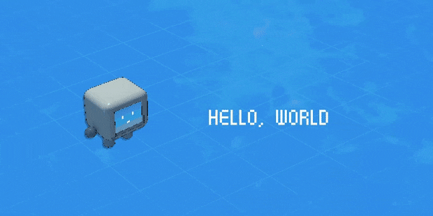
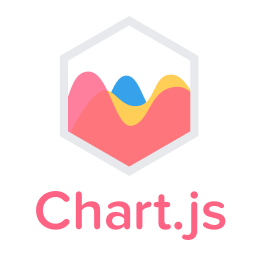

 

<h1 align="center">Hi 👋, I'm A. Rahman</h1>
<h3 align="center">A passionate developer with a background in chemistry</h3>

  

- 📚 I'm a computer science student at **Oregon State University**

- 👨‍🔬 I’m currently working as a laboratory technician at a biotechnology company

- 💻 I’m currently learning **Redux and Next.js**

- 💬 Ask me about anything and I'll be happy to answer
  

<table>
    <h3 align="center"> Skills and Technologies    

<tr><td valign="top" width="33%">

<h4 align="center"> Frontend  

  
  
  
  
  
  
  
  
  

</td><td valign="top" width="33%">

<h4 align="center"> Backend  

  
  
  
  
  
  
  
  
  
  

</td><td valign="top" width="33%">

<h4 align="center"> Devops  

  
  
  
  
  
  

</td></tr></table>  

   
    

